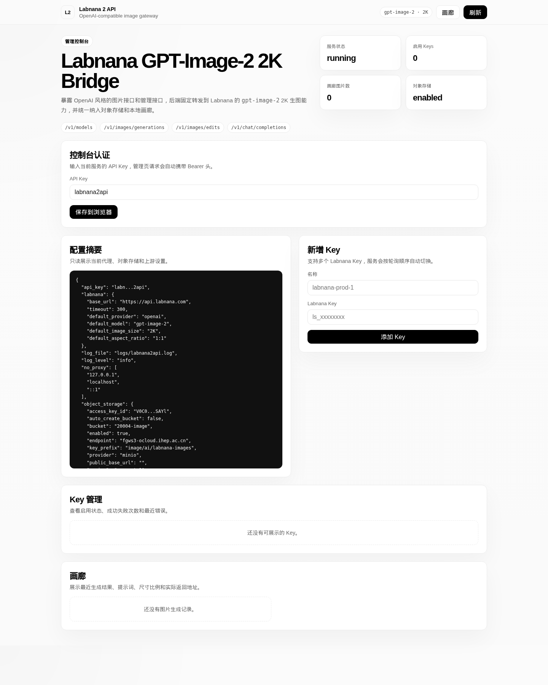
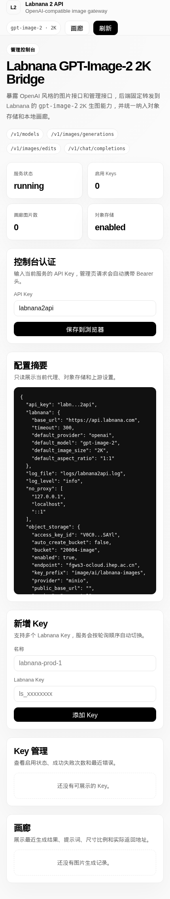

# labnana2api

一个 OpenAI 兼容的图片网关服务，后端固定转发到 Labnana 的 `gpt-image-2` 2K 生图接口，并提供多 key 轮询、对象存储落图、在线 key 管理和画廊浏览能力。

目前支持的兼容接口：

- `GET /v1/models`
- `POST /v1/images/generations`
- `POST /v1/images/edits`
- `POST /v1/chat/completions`

管理接口和页面：

- `GET /`
- `GET /api/telemetry`
- `GET /api/config`
- `GET /api/keys`
- `POST /api/keys`
- `PATCH /api/keys/:name`
- `DELETE /api/keys/:name`
- `POST /api/keys/:name/check`
- `GET /api/gallery`

## 当前限制

- 当前只接入 Labnana 的 `gpt-image-2`
- 服务端固定使用 `2K`
- 单次最多使用 4 张参考图
- `chat/completions` 只支持把图片生成结果作为 Markdown 图片链接返回

## 快速开始

要求：

- Go 1.25+
- Linux
- 可访问 Labnana API
- 如需代理，确保本机代理地址可用

首次生成配置：

```bash
./scripts/generate-config.sh
```

编辑本地配置：

```bash
vi config.json
```

把你的 Labnana key 填到：

```json
{
  "labnana_keys": [
    {
      "name": "prod-1",
      "key": "ls_xxxxxxxxxxxxx",
      "enabled": true
    }
  ]
}
```

启动：

```bash
./scripts/start.sh
```

查看状态：

```bash
./scripts/status.sh
```

查看日志：

```bash
./scripts/logs.sh
```

查看 stdout 重定向日志：

```bash
./scripts/logs.sh stdout
```

停止：

```bash
./scripts/stop.sh
```

## 配置说明

运行配置文件是 `config.json`，示例文件是 `config.example.json`。

关键字段：

- `api_key`: 你暴露给客户端的服务鉴权 key
- `proxy`: 请求 Labnana 时使用的代理地址，默认是 `http://127.0.0.1:19090`
- `public_base_url`: 如果服务部署在反向代理后，建议显式配置成外部访问地址
- `labnana.base_url`: 默认 `https://api.labnana.com`
- `labnana.default_model`: 固定 `gpt-image-2`
- `labnana.default_image_size`: 固定 `2K`
- `labnana_keys`: 可配置多个 Labnana key，服务端会自动轮询
- `object_storage`: 生成图片上传对象存储的配置

说明：

- `config.json` 已被 `.gitignore` 忽略，不会进入仓库
- 如果对象存储未启用或上传失败，图片会回退为本地 `media` 地址

## 管理页

默认地址：

```text
http://127.0.0.1:18082/
```

支持：

- 输入当前服务的 `api_key`
- 在线新增、停用、删除、检查 Labnana key
- 查看配置摘要
- 浏览最近生成的图片画廊

管理页截图：

桌面端：



移动端：



## OpenAI 兼容调用示例

服务默认监听 `18082`，以下示例假设：

- 服务地址：`http://127.0.0.1:18082`
- 服务 API Key：`labnana2api`

### 1. 查询模型

```bash
curl http://127.0.0.1:18082/v1/models \
  -H "Authorization: Bearer labnana2api"
```

### 2. 文生图

```bash
curl http://127.0.0.1:18082/v1/images/generations \
  -H "Authorization: Bearer labnana2api" \
  -H "Content-Type: application/json" \
  -d '{
    "model": "gpt-image-2",
    "prompt": "一只柴犬在雪地里奔跑，阳光洒在雪面上",
    "size": "1024x1024",
    "response_format": "url"
  }'
```

说明：

- `size` 会被映射为宽高比
- 实际上游分辨率固定为 `2K`
- `response_format` 支持 `url` 和 `b64_json`

支持的常见尺寸映射：

- `1024x1024` -> `1:1`
- `1024x1536` -> `2:3`
- `1536x1024` -> `3:2`
- `1024x1792` -> `9:16`
- `1792x1024` -> `16:9`

### 3. 带参考图生成

JSON 方式：

```bash
curl http://127.0.0.1:18082/v1/images/generations \
  -H "Authorization: Bearer labnana2api" \
  -H "Content-Type: application/json" \
  -d '{
    "model": "gpt-image-2",
    "prompt": "保留人物姿态，改成赛博朋克城市夜景",
    "image_url": "https://example.com/reference.png",
    "response_format": "url"
  }'
```

Multipart 方式：

```bash
curl http://127.0.0.1:18082/v1/images/edits \
  -H "Authorization: Bearer labnana2api" \
  -F "model=gpt-image-2" \
  -F "prompt=把背景改成热带海边日落" \
  -F "image=@./input.png"
```

### 4. Chat Completions 方式调用图片生成

```bash
curl http://127.0.0.1:18082/v1/chat/completions \
  -H "Authorization: Bearer labnana2api" \
  -H "Content-Type: application/json" \
  -d '{
    "model": "gpt-image-2",
    "messages": [
      {
        "role": "user",
        "content": [
          {
            "type": "text",
            "text": "生成一张极简海报，主题是红色月亮和黑色海面"
          }
        ]
      }
    ]
  }'
```

返回内容是：

```markdown

```

如果继续在聊天里引用上一轮返回的 Markdown 图片链接，也会自动作为参考图继续编辑。

## 画廊和存储

生成结果的处理顺序：

1. 先保存到本地 `.runtime/media`
2. 再尝试上传到对象存储
3. 成功则返回对象存储 URL
4. 失败则回退到本地 `/media/...` 地址

画廊元数据保存在：

- `.runtime/gallery.json`

本地图片文件保存在：

- `.runtime/media/`

## 项目结构

```text
cmd/labnana2api/         程序入口
internal/config/         配置读取和默认值
internal/httpclient/     代理感知的 HTTP 客户端
internal/labnana/        Labnana 上游调用
internal/server/         OpenAI 兼容接口和管理接口
internal/storage/        MinIO / S3 兼容对象存储
internal/gallery/        本地画廊元数据
internal/web/            内嵌管理页
scripts/                 启停和运维脚本
```
